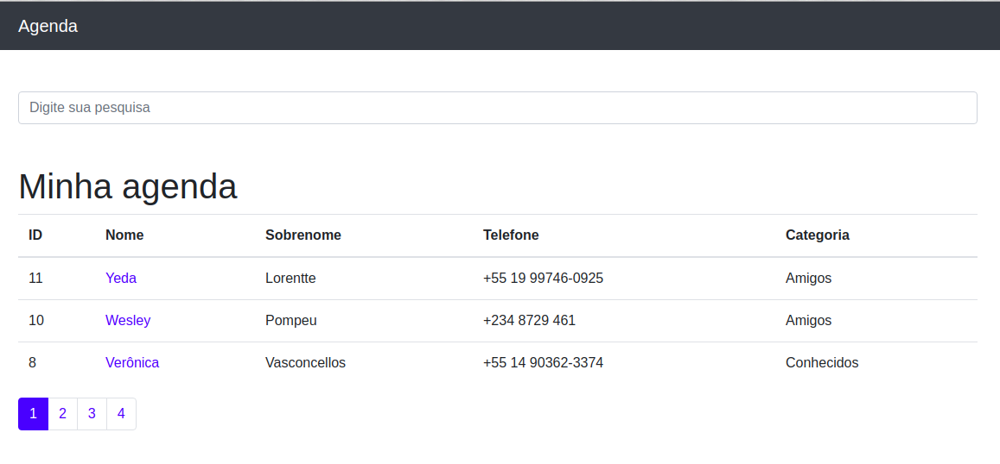

# django-agenda
A contacts agenda built with Django

#### Scripts to run the server:

- python -m venv venv
- . ./venv/bin/activate
- pip install -r requirements.txt
- python manage.py runserver

#### Run the under script to freeze the dependencies:

- pip freeze > requirements.txt

---

##### Sample:

